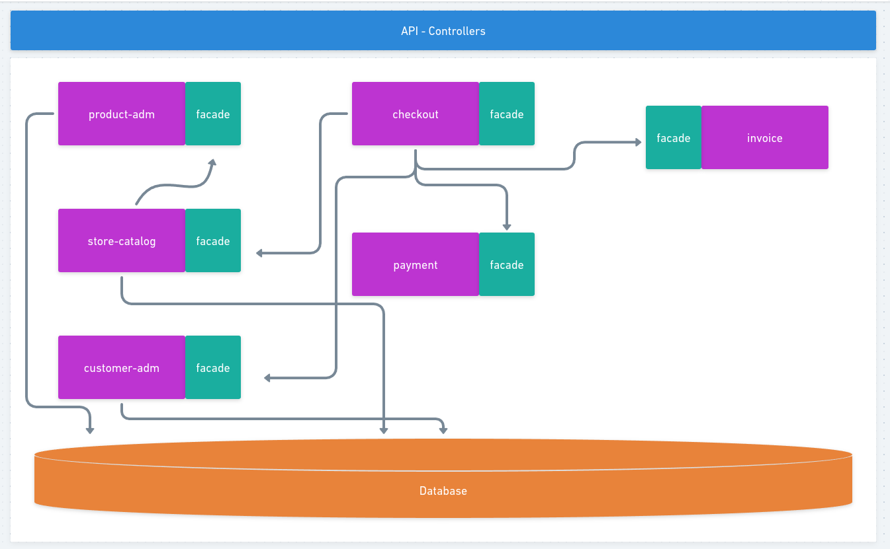

<h1 align="center"> Store - Arquitetura Monolítica </h1>

  Projeto realizado para fixar conhecimentos relacionado a arquitetura monolítica ultilizando o pattern (facade).

    <a href="#-motivação">Motivação</a>&nbsp;&nbsp;&nbsp;|&nbsp;&nbsp;&nbsp;
    <a href="#-tecnologias">Tecnologias</a>&nbsp;&nbsp;&nbsp;|&nbsp;&nbsp;&nbsp;
    <a href="#-projeto">Projeto</a>&nbsp;&nbsp;&nbsp;|&nbsp;&nbsp;&nbsp;
    <a href="#-instalação">Instalação</a>&nbsp;&nbsp;&nbsp;

 

  

 

## 👨‍💻 Motivação

Razões pelas quais fiz esse projeto:

- Aprender como construir uma aplicação monolítica de uma forma que seja manutenível e escalável ao longo do tempo.
- Entender como aplicar o pattern facade nas camadas de comunicação entre os módulos internos do projeto.
- Ampliar a visão de construção de módulos desacoplados.
- Compreender os traidoffs que uma arquitetura monolítica possui.
- Consolidar os conceitos do DDD.
- Exercita a forma de desenvolvimento orientado a Testes (TDD).

 

## 🚀 Tecnologias

Esse projeto foi desenvolvido com as seguintes tecnologias:

- Node com Typescript
- Jest
- Express
- Sequelize

Esse projeto foi desenvolvido com as seguintes Arquitetura e Patterns:

- Arquitetura Monolítica
- DDD (Driven Domain Designer)
- TDD (Test Driven Development)
- Facades
- Injeção / Inversão de Dependências
- Comunicação Rest

 

## 💻 Projeto

O projeto Store é uma simulação de operações de um e-commerce, projetado para praticar a construção de sistemas monolíticos e aprimorar a comunicação intermodular, mantendo um baixo acoplamento entre componentes. Para alcançar isso, o padrão de design Facade foi implementado. Este padrão nos permite criar uma interface simplificada a "fachada" através da qual cada módulo disponibiliza suas funcionalidades para interação com os demais módulos internamente. Para a comunicação externa, optamos pela utilização de APIs REST, onde cada módulo oferece controladores específicos que permitem o acesso aos seus respectivos casos de uso. Isso contribui para um desenho de sistema coeso e modular, onde a manutenção e a expansão se tornam mais gerenciáveis.

 

## 🚩 Instalação

- Em desenvolvimento

 

## 🚧 Items que ainda estão sendo desenvolvidos

- CRIAR O MODEL DE CHECKOUT 
- CRIAR O REPOSITORY DE CHECKOUT 
- ADICIONAR O CAMPO DOCUMENT EM CLIENT PARA SER ULTILIZADO NO INVOICE